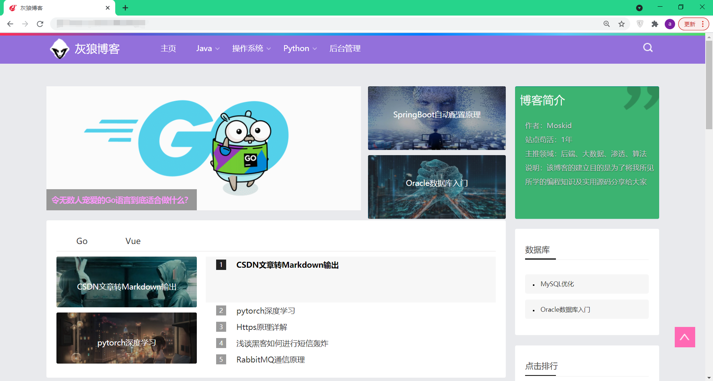
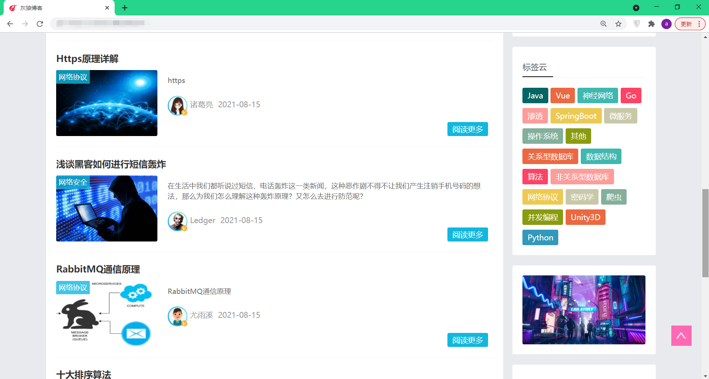
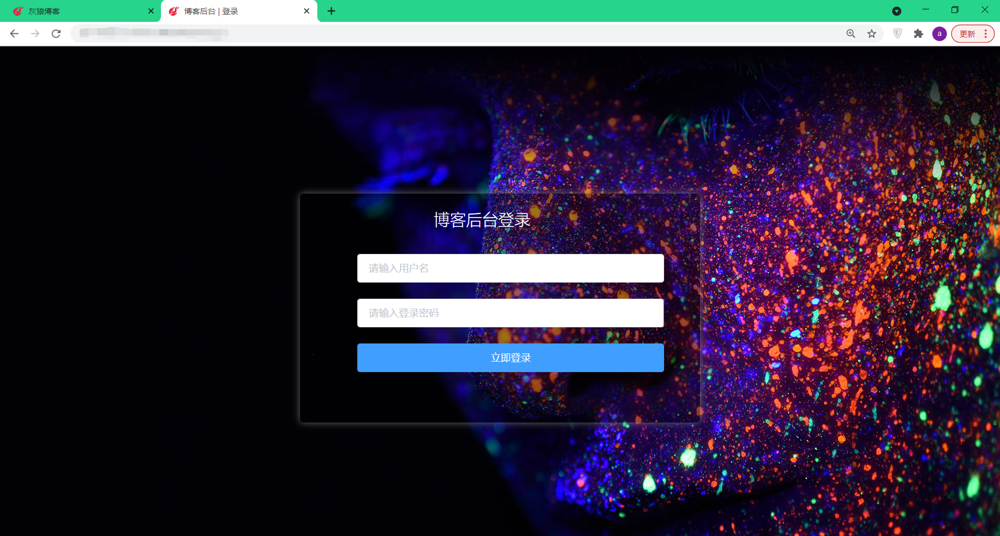
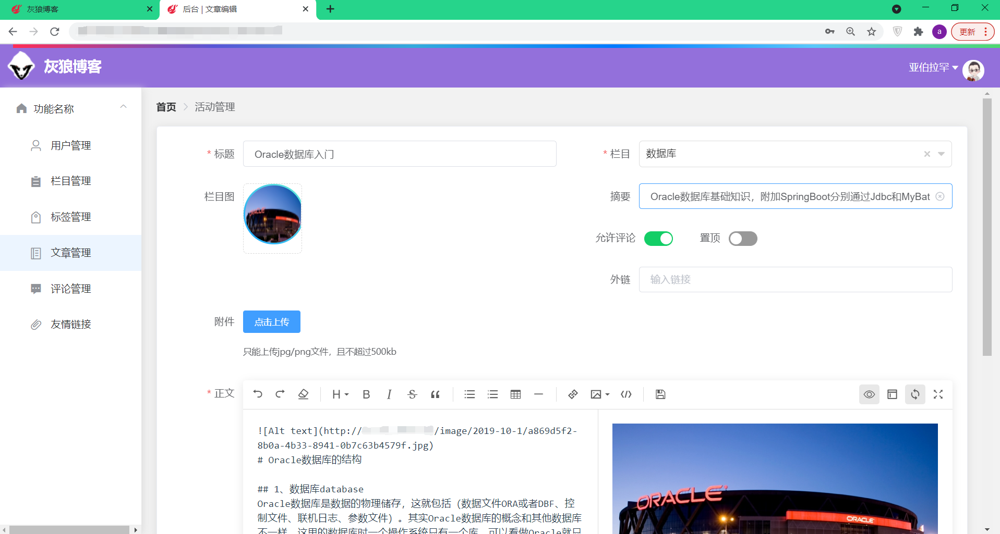

# SpringBoot与Vue构建的个人博客

## 展示

## 安装

### 前端

> 注意skitter是本人自改过的包，直接引用npm install的skitter包可能报错

[需要包的话可以访问这里]()

### 后端：

- 如果你想用Nacos,请把yml文件里所有的内容上传到vue-blog-dev.yaml中

- 如果你想用原生的SpringBoot，那么请删掉bootstrap.yml和nacos依赖

- 如果打包之后没带上配置文件从而报错，请不要注释pom.xml的build.resources
